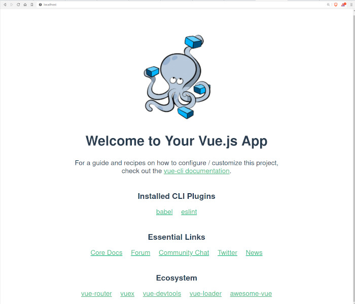

# Project Red Canyon

### Local Dev
Under development this project was built using [Docker compose](https://docs.docker.com/compose/).

#### Requirements
* Docker compose
* Node

### The Project Structure

Project structure:
```
.
├── compose.yaml
├── README.md
├── server
└── red-canyon-web
    ├── Dockerfile
    └── ...
```

[_compose.yaml_](compose.yaml)
```yaml
networks:
  redcanyon-net:
    driver: bridge

services:
  web:
    container_name: vue-web
    build:
      context: red-canyon-web
      target: development
    ports:
      - 5173:5173
    volumes:
      - ./red-canyon-web:/project
      - /project/node_modules
    networks:
      - redcanyon-net
  server:
    container_name: places-api
    ports:
      - 4200:4200
    expose:
      - 4200
    volumes:
      - ./server:/project
    build:
      context: ./server
      dockerfile_inline: |
        FROM node:22-bookworm-slim
        RUN mkdir /project
        WORKDIR /project
        COPY . .
        RUN npm install
    command: npm run dev -- --host=0.0.0.0
    networks:
      - redcanyon-net
```
The compose file defines an application with two services `web` and `server` application with container names `vue-web` and `places-api` respectively.
When deploying the application, docker compose maps port 5173 of the `vue-web` container and 4200 of the `places-api` container to ports 5173 and 4200, respectively of the host as specified in the file.
Make sure that these ports on the host are not already in use before running.

## Running the application with docker compose

1. Navigate to the server directory and run `npm install`
2. In the root directory, use `docker compose up` to run the application, you can add the `-d` flag to run in detached mode.

## Expected result

Listing containers must show one container running and the port mapping as below:
```
$ docker ps
CONTAINER ID   IMAGE               COMMAND                  CREATED             STATUS             PORTS                    NAMES
f6bfe9f6dabb   red-canyon-server   "docker-entrypoint.s…"   About an hour ago   Up About an hour   0.0.0.0:4200->4200/tcp   places-api
07a0da09e9a2   red-canyon-web      "docker-entrypoint.s…"   2 hours ago         Up About an hour   0.0.0.0:5173->5173/tcp   vue-web
```

After the application starts, navigate to `http://localhost:5173` in your web browser.



#### Stop and remove the containers
If the server was run in detached mode:

```
$ docker compose down
[+] Stopping 2/2
 ✔ Container red-canyon-server-1  Stopped
 ✔ Container red-canyon-web-1     Stopped
```


### REDIS Schema and Indexing

1. What will be stored in redis:
  * Google places, categorized by type. Key will follow `places:${type}:${placeId}`
  * The redis value for this will consist of: `{"id": "", "name": "string", "description": "string", "location": "string", "realLocation": { "lat": "number", "lng": "number" }, "rating": "number", "operatingHours":"[object]"`